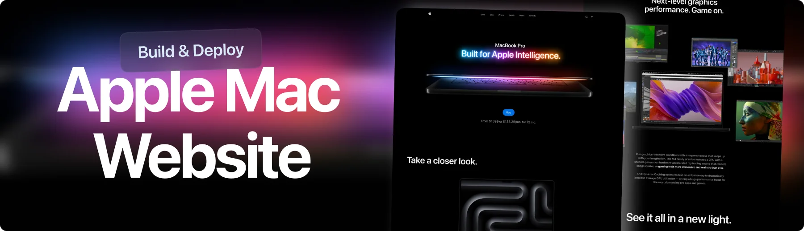

<div align="center">
  <br />
    <a href="https://youtu.be/DEeaT6FxEws" target="_blank">
      
    </a>
  <br />

  <div>


  </div>

  <h3 align="center">Apple Mabook Website</h3>

   <div align="center">
     Build this project step by step with our detailed tutorial on <a href="https://www.youtube.com/watch?v=XUkNR-JfHwo" target="_blank"><b>JavaScript Mastery</b></a> YouTube. Join the JSM family!
    </div>
</div>

## 📋 <a name="table">Table of Contents</a>

1. ✨ [Introduction](#introduction)
2. ⚙️ [Tech Stack](#tech-stack)
3. 🔋 [Features](#features)
4. 🤸 [Quick Start](#quick-start)
5. 🔗 [Assets](#links)
6. 🚀 [More](#more)

## 🚨 Tutorial

This repository contains the code corresponding to an in-depth tutorial available on our YouTube channel, <a href="https://www.youtube.com/@javascriptmastery/videos" target="_blank"><b>JavaScript Mastery</b></a>.

If you prefer visual learning, this is the perfect resource for you. Follow our tutorial to learn how to build projects like these step-by-step in a beginner-friendly manner!

<a href="https://youtu.be/DEeaT6FxEws" target="_blank"></a>

## <a name="introduction">✨ Introduction</a>

Apple-style 3D website built with React, Three.js, GSAP, and TailwindCSS! Showcase products in immersive 3D scenes, scroll-animated models, and pinned sections. Featuring responsive design, smooth timeline animations, and visually striking image transitions—perfect for developers creating interactive, modern web experiences.

If you're getting started and need assistance or face any bugs, join our active Discord community with over **50k+** members. It's a place where people help each other out.

<a href="https://discord.com/invite/n6EdbFJ" target="_blank"></a>

## <a name="tech-stack">⚙️ Tech Stack</a>

- **[CodeRabbit](https://jsm.dev/mbook-coderabbit)** is an AI-powered code review tool that integrates with IDEs like VS Code and Git platforms such as GitHub and GitLab. It provides real-time, context-aware feedback on pull requests, including line-by-line analysis, security vulnerability detection, and adherence to coding standards. CodeRabbit learns from your team's preferences, adapting its reviews over time to enhance code quality and developer productivity.

- **[GSAP](https://gsap.com/)** is a powerful JavaScript animation library used in this project to create dynamic, scroll-driven visuals. Features include SplitText animations for bold text reveals, ScrollTrigger for timeline control, parallax scrolling, pinned sections, scroll-synced video playback, seamless multi-section timelines, image masking effects, and a fully custom animated carousel.

- **[Hostinger](https://jsm.dev/mbook-hostinger)** is a web hosting platform used in this project to deploy and manage the live website. Features include fast and reliable hosting, user-friendly control panel, one-click app installations, domain management, SSL certification, scalable server resources, and strong uptime guarantees to ensure smooth production deployment.

- **[React](https://react.dev/)** is a declarative JavaScript library for building interactive UIs. It provides the component structure for modular development, allowing smooth integration of GSAP animations, reusable logic for scroll behavior, and support for responsive layout and state-driven UI features like carousels and video sections.

- **[Tailwind CSS](https://tailwindcss.com/)** is a utility-first CSS framework that allows developers to design custom user interfaces by applying low-level utility classes directly in HTML, streamlining the design process.

- **[Three.js](https://threejs.org/)** is a powerful JavaScript 3D library used in this project to render interactive 3D graphics in the browser. Features include WebGL-based rendering, support for cameras, lights, and materials, 3D model importing, geometry and texture manipulation, scene graph management, animation capabilities, raycasting for interactivity, and integration with physics and post-processing effects for immersive experiences.

- **[Vite](https://vitejs.dev/)** is a lightning-fast build tool and development server that powers this project’s workflow. It enables instant hot module replacement, fast startup, and optimized production builds—ideal for an animation-heavy React site with smooth, real-time development feedback and minimal config.

- **[Zustand](https://zustand-demo.pmnd.rs/)** is a lightweight and flexible state management library for React. In this project, it’s used to manage global state efficiently, enabling reactive updates with minimal boilerplate. Features include simple store creation, easy state slicing, middleware support for logging and persistence, seamless integration with React components, and performant state updates without unnecessary re-renders.

## <a name="features">🔋 Features</a>

👉 **3D Product Scene with Realistic Lighting System**: Showcase products in lifelike 3D environments for maximum visual impact.

👉 **Animate 3D Model on Scroll**: Create immersive interactions by animating 3D models based on user scroll position.

👉 **ScrollTrigger Effects**: Power scroll-based animations and timeline control with GSAP’s ScrollTrigger.

👉 **Pinned Sections**: Lock sections in view while animating content for engaging scroll experiences.

👉 **Image Masking Effects**: Use scroll-triggered pins and masks for visually striking image transitions.

👉 **Seamless Timeline Animations**: Craft smooth animation timelines that span across multiple sections.

👉 **Responsive Design**: Ensure fluid UI and adaptive GSAP animations across all screen sizes.

And many more, including code architecture and reusability.

## <a name="quick-start">🤸 Quick Start</a>

Follow these steps to set up the project locally on your machine.

**Prerequisites**

Make sure you have the following installed on your machine:

- [Git](https://git-scm.com/)
- [Node.js](https://nodejs.org/en)
- [npm](https://www.npmjs.com/) (Node Package Manager)

**Cloning the Repository**

```bash
git clone https://github.com/adrianhajdin/gsap_macbook_landing.git
cd gsap_macbook_landing
```

**Installation**

Install the project dependencies using npm:

```bash
npm install
```

**Running the Project**

```bash
npm run dev
```

Open [http://localhost:5173](http://localhost:5173) in your browser to view the project.

## <a name="links">🔗 Assets</a>

Assets and snippets used in the project can be found in the **[video kit](https://jsm.dev/mbook-kit)**.

<a href="https://jsm.dev/mbook-kit" target="_blank">
  
</a>

## <a name="more">🚀 More</a>

**Advance your skills with Next.js Pro Course**

Enjoyed creating this project? Dive deeper into our PRO courses for a richer learning adventure. They're packed with
detailed explanations, cool features, and exercises to boost your skills. Give it a go!

<a href="https://jsm.dev/mbook-jsm" target="_blank">
  
</a>
